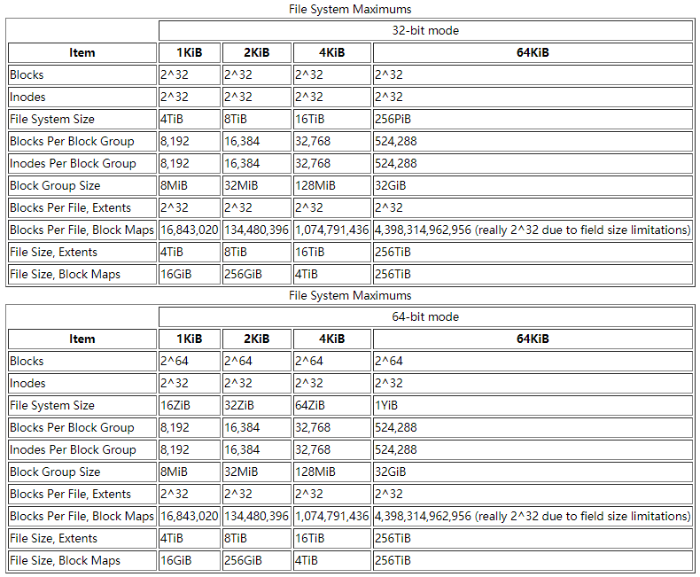
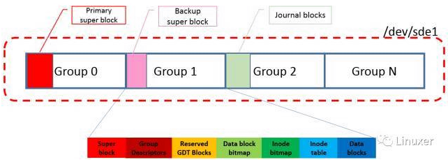

http://www.sohu.com/a/229842067_467784

https://linux.cn/article-11288-1.html?pr

https://blog.csdn.net/wennuanddianbo/article/details/86749867

https://blog.csdn.net/feiying0canglang/article/details/102730096

https://www.cnblogs.com/jiangcsu/p/5733524.html

# Ext4 Disk Layout

> Ext4 的blocks大小通常为4KiB，每个block groups包含32768的块，长度为128MiB。block groups的数量是设备的大小除以块组的大小。ext4中的所有字段都以little-endian顺序写入磁盘。但是，jbd2（日志）中的所有字段都以big-endian顺序写入磁盘。

## Blocks



## Layout

> 标准block group的布局分布如下：

| Group 0 Padding | ext4 Super Block | Group Descriptors | Reserved GDT Blocks | Data Block Bitmap | inode Bitmap | inode Table | Data Blocks |
|:---:|:---:|:---:|:---:|:---:|:---:|:---:|:---:|
| 1024 bytes | 1 block | many blocks | many blocks | 1 block | 1 block | many blocks | many more blocks|



> 在 mkfs.ext4命令格式化完块设备以后,ext4的layout在块设备上大致如上图所描述, 包含了一下信息:
> * 块设备被按group 来划分,每个group有对应的group deor
> * Super block在Group 0中, 非group 0中的super block是backup super block
> * Journal block的位置并不是在最后一个group.(本例中,journal block在group 2)

## 定位文件系统超级块superblock

> 首先, 如果磁盘是DOS的分区格式, 那就用fdisk命令查看一下磁盘的分区信息. 从磁盘的分区信息我们可以得到以下内容:
> * 整个磁盘有多大
> * 磁盘被分成了多少个分区
> * 每个分区的大小和起始结束的位置

``` {.line-numbers}
hero@debian:~$ lsblk
NAME   MAJ:MIN RM  SIZE RO TYPE MOUNTPOINT
sda      8:0    0  150G  0 disk 
├─sda1   8:1    0  146G  0 part /
├─sda2   8:2    0    1K  0 part 
└─sda5   8:5    0    4G  0 part [SWAP]
sdb      8:16   1 14.5G  0 disk 
└─sdb1   8:17   1 14.4G  0 part 
sr0     11:0    1 1024M  0 rom  
hero@debian:~$ sudo fdisk -l /dev/sdb1 
[sudo] password for hero: 
Disk /dev/sdb1: 14.4 GiB, 15418261504 bytes, 30113792 sectors
Units: sectors of 1 * 512 = 512 bytes
Sector size (logical/physical): 512 bytes / 512 bytes
I/O size (minimum/optimal): 512 bytes / 512 bytes
Disklabel type: dos
Disk identifier: 0x500a0dff

Device      Boot      Start        End    Sectors   Size Id Type
/dev/sdb1p1      1948285285 3650263507 1701978223 811.6G 6e unknown
/dev/sdb1p2               0          0          0     0B 74 unknown
/dev/sdb1p4        28049408   28049848        441 220.5K  0 Empty

Partition table entries are not in disk order.
```

> 这是OK6410 **SD_Writer.exe** 制作的SD卡启动卡。现在格式化SD卡为Ext4格式。

``` {.line-numbers}
hero@debian:~$ sudo fdisk /dev/sdb

Welcome to fdisk (util-linux 2.29.2).
Changes will remain in memory only, until you decide to write them.
Be careful before using the write command.


Command (m for help): p
Disk /dev/sdb: 14.5 GiB, 15523119104 bytes, 30318592 sectors
Units: sectors of 1 * 512 = 512 bytes
Sector size (logical/physical): 512 bytes / 512 bytes
I/O size (minimum/optimal): 512 bytes / 512 bytes
Disklabel type: dos
Disk identifier: 0xda91aa07

Device     Boot Start      End  Sectors  Size Id Type
/dev/sdb1        2048 30115839 30113792 14.4G  c W95 FAT32 (LBA)

Command (m for help): d
Selected partition 1
Partition 1 has been deleted.

Command (m for help): n
Partition type
   p   primary (0 primary, 0 extended, 4 free)
   e   extended (container for logical partitions)
Select (default p): p
Partition number (1-4, default 1): 1
First sector (2048-30318591, default 2048): 2048
Last sector, +sectors or +size{K,M,G,T,P} (2048-30318591, default 30318591): 

Created a new partition 1 of type 'Linux' and of size 14.5 GiB.
Partition #1 contains a vfat signature.

Do you want to remove the signature? [Y]es/[N]o: Y

The signature will be removed by a write command.

Command (m for help): w
The partition table has been altered.
Calling ioctl() to re-read partition table.
Syncing disks.
```

> 上述fdisk的命令可以百度查看，是常用新建分区的一系列操作。
>
> **对于为什么第一个分区从2048扇区（2048*521/(1024*1024)=1M）开始**，解答如下：
> * With the death of the legacy BIOS (ok, its not quite dead yet) and its replacement with EFI BIOS, a special boot partitionis needed to allow EFI systems to boot in EFI mode.
Starting the first partition at sector 2048 leaves 1Mb for the EFI boot code. Modern partitioning tools do this anyway and fdisk has been updated to follow suit.
随着传统BIOS的死亡（不确定，它还没有完全死亡）并且用EFI BIOS替代它，需要一个特殊的启动分区来允许EFI系统以EFI模式启动。
在扇区2048处启动第一个分区会留下1Mb用于EFI引导代码。 现代分区工具无论如何都会这样做，并且fdisk已经更新。

> 接下来格式化为Ext4文件系统：

``` {.line-numbers}
hero@debian:~$ ls /dev/sdb*
/dev/sdb  /dev/sdb1
hero@debian:~$ sudo mke2fs -t ext4 -L "testdisk" /dev/sdb1
[sudo] password for hero: 
mke2fs 1.43.4 (31-Jan-2017)
Creating filesystem with 3789568 4k blocks and 948416 inodes
Filesystem UUID: d7813e76-c94d-4220-a6c2-85b9f0aa4feb
Superblock backups stored on blocks: 
	32768, 98304, 163840, 229376, 294912, 819200, 884736, 1605632, 2654208

Allocating group tables: done                            
Writing inode tables: done                            
Creating journal (16384 blocks): done
Writing superblocks and filesystem accounting information: done

hero@debian:~$ sudo fdisk -l /dev/sdb
Disk /dev/sdb: 14.5 GiB, 15523119104 bytes, 30318592 sectors
Units: sectors of 1 * 512 = 512 bytes
Sector size (logical/physical): 512 bytes / 512 bytes
I/O size (minimum/optimal): 512 bytes / 512 bytes
Disklabel type: dos
Disk identifier: 0xda91aa07

Device     Boot Start      End  Sectors  Size Id Type
/dev/sdb1        2048 30318591 30316544 14.5G 83 Linux
```

> mke2fs命令是专门用于管理ext系列文件系统的一个专门的工具。其还有像mkfs.ext2，mkfs.ext3，mkfs.ext4等衍生的命令，它们的用法mke2fs类似，在系统man下它们的帮助手册会直接跳转mke2fs命令的帮助手册。

> 当然也可以用新的sfdisk和mkfs.ext4工具来格式化。


