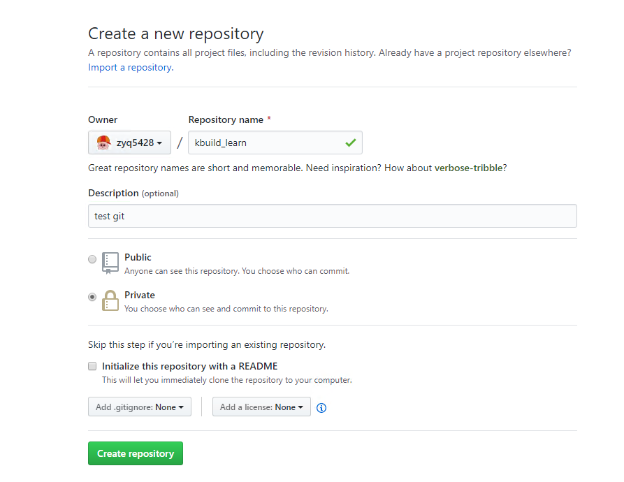
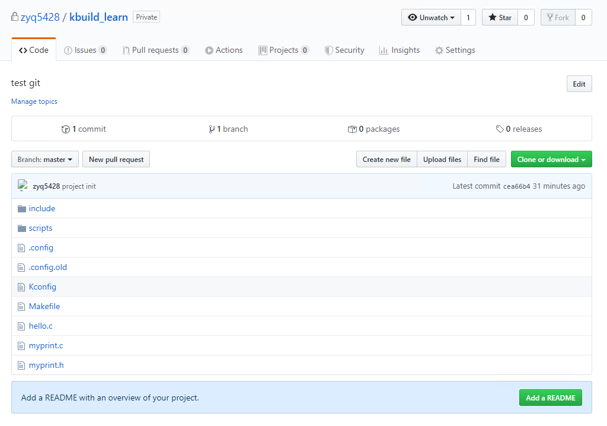

# 常用Git操作

## 远程仓库的使用

### clone 远程仓库

``` {.line-numbers highlight=[1]}
hero@hero:~/git$ git clone https://github.com/zyq5428/hero.git
Cloning into 'hero'...
Username for 'https://github.com': zyq5428
Password for 'https://zyq5428@github.com': 
remote: Enumerating objects: 3, done.
remote: Counting objects: 100% (3/3), done.
remote: Total 3 (delta 0), reused 0 (delta 0), pack-reused 0
Unpacking objects: 100% (3/3), done.
hero@hero:~/git/hero$ git remote -v
origin	https://github.com/zyq5428/hero.git (fetch)
origin	https://github.com/zyq5428/hero.git (push)
hero@hero:~/git/hero$
```

> 为了方便clone，首先我们需要进行一些设置
> 设置buff为1500M,防止一些下载错误
> * git config --global http.postBuffer 1572864000
> * git config --global user.name "zyq5428"
> * git config --global user.email "594270026@qq.com"
> Https记住密码
> * git config --global credential.helper store

``` {.line-numbers highlight=[1, 2, 3, 5]}
hero@hero:~/git$ git config --global http.postBuffer 1572864000
hero@hero:~/git$ git config --global user.name "zyq5428"
hero@hero:~/git$ git config --global user.email "594270026@qq.com"
hero@hero:~/git/hero$ git config --global credential.helper store
hero@hero:~/git/hero$ git config --global --list
user.email=594270026@qq.com
user.name=zyq5428
color.ui=auto
http.postbuffer=1572864000
credential.helper=store
```

> **对于git clone EOF的解决方案**
>
> * 首先，关闭压缩：
git config --global core.compression 0
> * 接下来，让我们做一个部分克隆来截断下来的信息量：
git clone --depth 1 <repo_URI>
> * 这样做后，进入新目录并检索克隆的其余部分：
git fetch --unshallow
> * 或者，交替地，
git fetch --depth=2147483647
> * 现在，做一个常规拉：
git pull --all
> * 我认为，在1.8.x版本中，msysgit出现了故障，加剧了这些症状，因此，另一种选择是尝试使用较早版本的git(我认为<=1.8.3)。
> * 之后如果以前的仓库无法正常fetch，请把压缩恢复为默认值-1
git config --global core.compression -1
>
> core.compression
> 一个整数-1..9，表示默认的压缩级别。-1是 zlib 的默认值。0代表没有压缩，1..9代表不同的速度/尺寸折衷，9代表最慢。如果设置，则会为其他压缩变量。

### 从远程仓库中抓取与拉取

> git fetch [remote-name]
> 这个命令会访问远程仓库，从中拉取所有你还没有的数据。执行完成后，你将会拥有那个远程仓库中所有分支的引用，可以随时合并或查看。
>
> 如果你使用 clone 命令克隆了一个仓库，命令会自动将其添加为远程仓库并默认以 “origin” 为简写。所以，git fetch origin 会抓取克隆（或上一次抓取）后新推送的所有工作。**必须注意 git fetch 命令会将数据拉取到你的本地仓库 - 它并不会自动合并或修改你当前的工作。**当准备好时你必须手动将其合并入你的工作。
>
> 如果你有一个分支设置为跟踪一个远程分支（阅读下一节与 Git 分支 了解更多信息），可以使用 git pull 命令来自动的抓取然后合并远程分支到当前分支。这对你来说可能是一个更简单或更舒服的工作流程；默认情况
下，git clone 命令会自动设置本地 master 分支跟踪克隆的远程仓库的 master 分支（或不管是什么名字的默认分支）。运行 git pull 通常会从最初克隆的服务器上抓取数据并自动尝试合并到当前所在的分支。

``` {.line-numbers highlight=[1]}
hero@hero:~/git/hero$ git fetch origin
Username for 'https://github.com': zyq5428	
Password for 'https://zyq5428@github.com': 
remote: Enumerating objects: 4, done.
remote: Counting objects: 100% (4/4), done.
remote: Compressing objects: 100% (2/2), done.
remote: Total 3 (delta 0), reused 0 (delta 0), pack-reused 0
Unpacking objects: 100% (3/3), done.
From https://github.com/zyq5428/hero
   1432267..7d696db  master     -> origin/master
hero@hero:~/git/hero$
```

> 要特别注意的一点是当抓取到新的远程跟踪分支时，本地不会自动生成一份可编辑的副本（拷贝）。换一句话说，这种情况下，不会有一个新的 master 分支 - 只有一个不可以修改的 origin/master 指针。
>
> 可以运行 git merge origin/master 将这些工作合并到当前所在的分支。如果想要在自己的master 分支上工作，可以将其建立在远程跟踪分支之上：

``` {.line-numbers highlight=[1, 3, 9]}
hero@hero:~/git/hero$ ls
README.md
hero@hero:~/git/hero$ git merge origin/master
Updating 1432267..7d696db
Fast-forward
 fetch.txt | 1 +
 1 file changed, 1 insertion(+)
 create mode 100644 fetch.txt
hero@hero:~/git/hero$ ls
fetch.txt  README.md
hero@hero:~/git/hero$ git log
commit 7d696db341eadb28244d4619ed420d2905974320 (HEAD -> master, origin/master, origin/HEAD)
Author: zyq5428 <594270026@qq.com>
Date:   Mon Jan 13 17:32:13 2020 +0800

    fetch test
    
    fetch test operation

commit 143226717d3623c7a66564d439c3749ba8dcfa19
Author: zyq5428 <594270026@qq.com>
Date:   Wed Oct 23 17:29:14 2019 +0800

    Initial commit
hero@hero:~/git/hero$
```

> git pull自动拉取并合并

``` {.line-numbers highlight=[1, 16, 18]}
hero@hero:~/git/hero$ git pull
Username for 'https://github.com': zyq5428
Password for 'https://zyq5428@github.com': 
remote: Enumerating objects: 4, done.
remote: Counting objects: 100% (4/4), done.
remote: Compressing objects: 100% (2/2), done.
remote: Total 3 (delta 0), reused 0 (delta 0), pack-reused 0
Unpacking objects: 100% (3/3), done.
From https://github.com/zyq5428/hero
   7d696db..1898fc3  master     -> origin/master
Updating 7d696db..1898fc3
Fast-forward
 pull.txt | 1 +
 1 file changed, 1 insertion(+)
 create mode 100644 pull.txt
hero@hero:~/git/hero$ ls
fetch.txt  pull.txt  README.md
hero@hero:~/git/hero$ git log
commit 1898fc375aa2d6f053b3921ad1261e076ebf2f7e (HEAD -> master, origin/master, origin/HEAD)
Author: zyq5428 <594270026@qq.com>
Date:   Mon Jan 13 17:57:32 2020 +0800

    pull test
    
    pull test operation

commit 7d696db341eadb28244d4619ed420d2905974320
Author: zyq5428 <594270026@qq.com>
Date:   Mon Jan 13 17:32:13 2020 +0800

    fetch test
    
    fetch test operation

commit 143226717d3623c7a66564d439c3749ba8dcfa19
Author: zyq5428 <594270026@qq.com>
Date:   Wed Oct 23 17:29:14 2019 +0800

    Initial commit
hero@hero:~/git/hero$
```

## 在现有目录中初始化仓库

> 如果你打算使用 Git 来对现有的项目进行管理，你只需要进入该项目目录并输入：

``` {.line-numbers highlight=[1]}
hero@hero:~/git/kbuild_learn$ git init
Initialized empty Git repository in /home/hero/git/kbuild_learn/.git/
hero@hero:~/git/kbuild_learn$
```

> 该命令将创建一个名为 .git 的子目录，这个子目录含有你初始化的 Git 仓库中所有的必须文件，这些文件是Git 仓库的骨干。但是，在这个时候，我们仅仅是做了一个初始化的操作，你的项目里的文件还没有被跟踪。(参见 Git 内部原理 来了解更多关于到底 .git 文件夹中包含了哪些文件的信息。)
>
> 如果你是在一个已经存在文件的文件夹（而不是空文件夹）中初始化 Git 仓库来进行版本控制的话，你应该开始跟踪这些文件并提交。你可通过 git add 命令来实现对指定文件的跟踪，然后执行 git commit 提交:

### 跟踪文件

> * git add *.c : 跟踪所有.c文件
>
> * git add . ：他会监控工作区的状态树，使用它会把工作时的所有变化提交到暂存区，包括文件内容修改(modified)以及新文件(new)，但不包括被删除的文件。
>
> * git add -u ：他仅监控已经被add的文件（即tracked file），他会将被修改的文件提交到暂存区。add -u 不会提交新文件（untracked file）。（git add --update的缩写）
>
> * git add -A ：是上面两个功能的合集（git add --all的缩写）
>
> 因为我的当前文件有很多文件，所以执行git add -A 命令。

``` {.line-numbers highlight=[1, 2]}
hero@hero:~/git/kbuild_learn$ git add -A
hero@hero:~/git/kbuild_learn$ git status
On branch master

No commits yet

Changes to be committed:
  (use "git rm --cached <file>..." to unstage)

	new file:   .config
	new file:   .config.old
	new file:   Kconfig
	new file:   Makefile
	new file:   hello.c
	new file:   include/config/auto.conf
	new file:   include/config/auto.conf.cmd
	new file:   include/config/myprint.h
	new file:   include/config/tristate.conf
	new file:   include/config/x86.h
	new file:   include/generated/autoconf.h
	new file:   myprint.c
	new file:   myprint.h
	new file:   scripts/conf
	new file:   scripts/mconf

hero@hero:~/git/kbuild_learn$
```

### 提交到本地仓库

``` {.line-numbers highlight=[1, 19]}
hero@hero:~/git/kbuild_learn$ git commit -m "project init"
[master (root-commit) cea66b4] project init
 15 files changed, 119 insertions(+)
 create mode 100755 .config
 create mode 100755 .config.old
 create mode 100755 Kconfig
 create mode 100755 Makefile
 create mode 100755 hello.c
 create mode 100755 include/config/auto.conf
 create mode 100755 include/config/auto.conf.cmd
 create mode 100755 include/config/myprint.h
 create mode 100755 include/config/tristate.conf
 create mode 100755 include/config/x86.h
 create mode 100755 include/generated/autoconf.h
 create mode 100755 myprint.c
 create mode 100755 myprint.h
 create mode 100755 scripts/conf
 create mode 100755 scripts/mconf
hero@hero:~/git/kbuild_learn$ git status
On branch master
nothing to commit, working tree clean
hero@hero:~/git/kbuild_learn$
```

### 与远程仓库进行关联

#### 创建远程仓库

> 在远程仓库(如github)创建项目,为不必要的避免错误,不建议初始化README, license, 或者gitignore文件。



#### 添加远程仓库

> 我在之前的章节中已经提到并展示了如何添加远程仓库的示例，不过这里将告诉你如何明确地做到这一点。运行**git remote add \<shortname\> \<url\>** 添加一个新的远程 Git 仓库，同时指定一个你可以轻松引用的简
写：

``` {.line-numbers highlight=[1, 3]}
hero@hero:~/git/kbuild_learn$ git remote add origin https://github.com/zyq5428/kbuild_learn.git
hero@hero:~/git/kbuild_learn$ git remote -v
origin	https://github.com/zyq5428/kbuild_learn.git (fetch)
origin	https://github.com/zyq5428/kbuild_learn.git (push)
hero@hero:~/git/kbuild_learn$
```

#### 推送本地提交到远程分支

> 当你想分享你的项目时，必须将其推送到上游。这个命令很简单：**git push [remote-name] [branchname]**。当你想要将 master 分支推送到 origin 服务器时（再次说明，克隆时通常会自动帮你设置好那两个名
字），那么运行这个命令就可以将你所做的备份到服务器：

``` {.line-numbers highlight=[1]}
hero@hero:~/git/kbuild_learn$ git push -u origin master
Username for 'https://github.com': zyq5428
Password for 'https://zyq5428@github.com': 
Counting objects: 20, done.
Delta compression using up to 2 threads.
Compressing objects: 100% (18/18), done.
Writing objects: 100% (20/20), 109.83 KiB | 4.07 MiB/s, done.
Total 20 (delta 2), reused 0 (delta 0)
remote: Resolving deltas: 100% (2/2), done.
To https://github.com/zyq5428/kbuild_learn.git
 * [new branch]      master -> master
Branch 'master' set up to track remote branch 'master' from 'origin'.
hero@hero:~/git/kbuild_learn$ git remote show origin
Username for 'https://github.com': zyq5428
Password for 'https://zyq5428@github.com': 
* remote origin
  Fetch URL: https://github.com/zyq5428/kbuild_learn.git
  Push  URL: https://github.com/zyq5428/kbuild_learn.git
  HEAD branch: master
  Remote branch:
    master tracked
  Local branch configured for 'git pull':
    master merges with remote master
  Local ref configured for 'git push':
    master pushes to master (up to date)
```

> * git push 如果当前分支与多个主机存在追踪关系，那么这个时候-u选项会指定一个默认主机，这样后面就可以不加任何参数使用git push。
>
> * git push -u origin master 上面命令将本地的master分支推送到origin主机，同时指定origin为默认主机，后面就可以不加任何参数使用git push了。
>
> * 不带任何参数的git push，默认只推送当前分支，这叫做simple方式。此外，还有一种matching方式，会推送所有有对应的远程分支的本地分支。Git 2.0版本之前，默认采用matching方法，现在改为默认采用simple方式。



